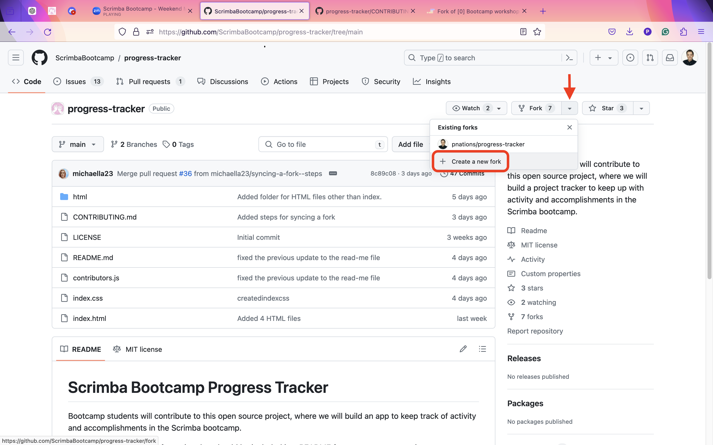
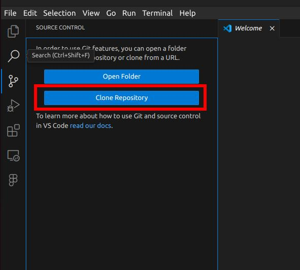
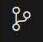
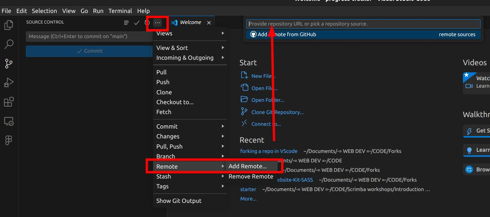
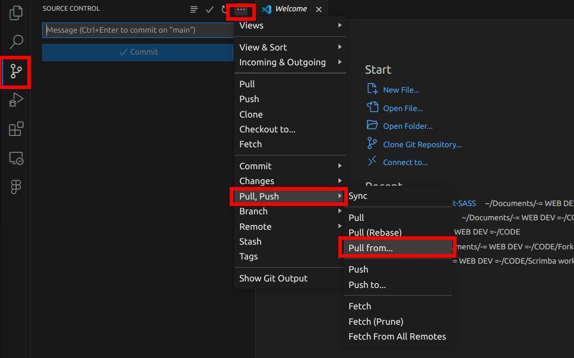
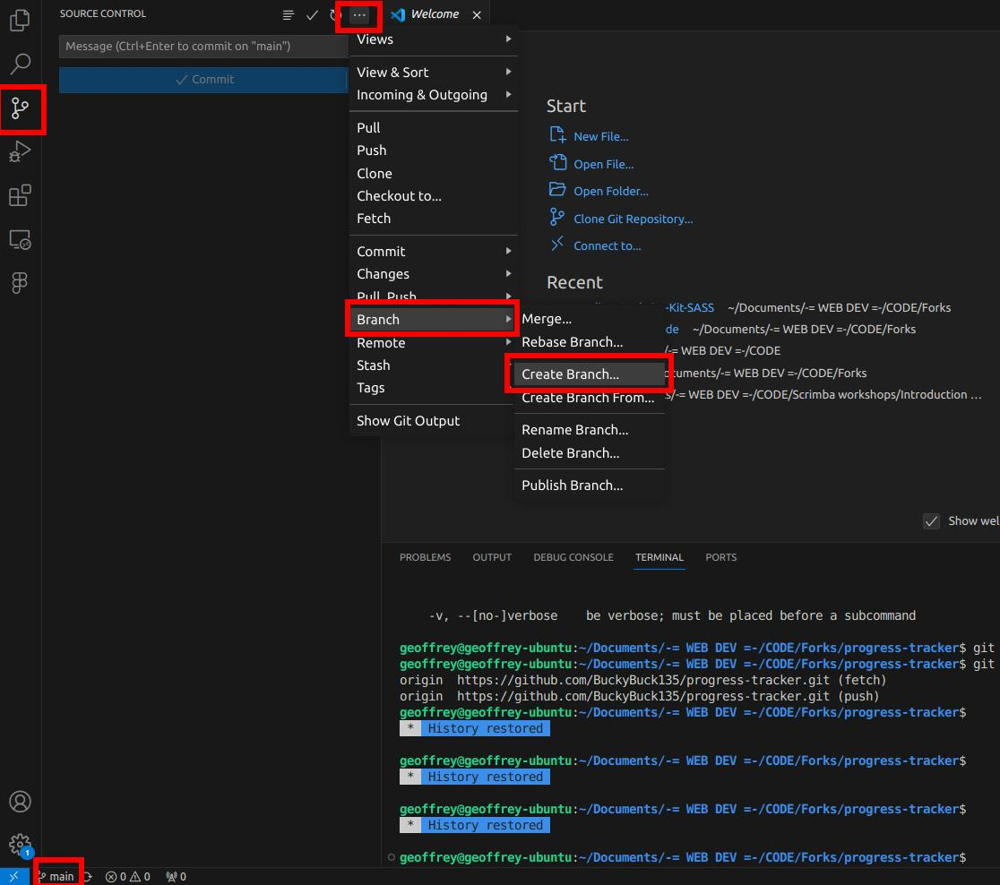
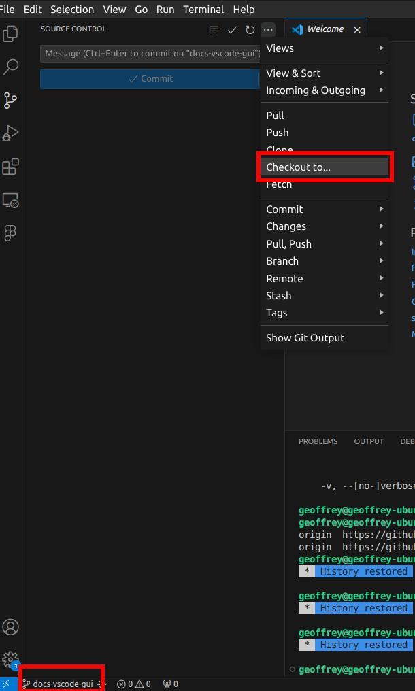

# Contributing to This Project
To contribute to an open source project, you will follow the git workflow. You will fork the main repository, clone it to your machine, make changes (in a branch), and follow steps to submit a pull request - so your changes can be merged with the main repo.

## General Guidelines
1. Look through our [Issues](https://github.com/ScrimbaBootcamp/progress-tracker/issues), and see if there is one you would like to take on. If there isn't an issue for a change you would like to make, please create a new Issue.
2. Ask to be assigned to an issue, and tag the maintainer(s). Pull requests without a corresponding issue may or may not be accepted.
3. Please work on one issue at a time in order to avoid miscommunication. If you find there is something else you would like to change while working on your issue, please follow the previous two steps to create a new Issue and - if you would like to work on it - ask to be assigned.
4. If you see code that was written by another contributor that you feel could be improved, you might wish to tag them in the issue that you create so that you can discuss potential changes and decide who will work on this issue. One or both of you may then request assignment to the issue.
5. Once you have been assigned to an issue, you can follow the protocol below.

## Get started
1. Go to [the main repository](https://github.com/ScrimbaBootcamp/project-tracker).
2. Fork the project.

3. Under 'Owner', you should see your own GitHub account, followed by 'productivity-app'.
4. Look at the other options. If you would like you can add a description, you can. You shouldn't need to change the branch that is being copied.
5. Click 'Create Fork'

You should be redirected to your fork of the repository. In the top left corner of the page you'll see '[Your-Username]/productivity-app' to the right of the Octocat logo. 

6. Look for the '<> Code' button above the list of files, and click on it. 
7. Copy the URL for (your) repository.

## Continue in the terminal
1. Open a terminal. 
2. Change the current working directory to the location where you want the cloned directory.\
For example: `cd Users/Some-Directory/project-tracker`
3. Type `git clone` and paste the URL that you just copied. Hit enter. Your local clone will be created.

### Configure git to sync changes with main repo
When you fork a project, you can configure git to pull down changes from the upstream repository into the local clone of your fork in addition to submitting requests to merge changes you've made.

1. In GitHub, go back to the project's [main repository](https://github.com/ScrimbaBootcamp/project-tracker).
2. Click on the '<> Code' button in that repo, and copy the URL.
3. Back in the terminal, type `git remote add upstream`, paste the URL and hit Enter.
4. To verify your remote repositories, type `git remote -v` and hit Enter. You should see something like this:
    ```
        $ git remote -v

        > origin    https://github.com/YOUR-USERNAME/YOUR-FORK.git (fetch)
        > origin    https://github.com/YOUR-USERNAME/YOUR-FORK.git (push)
        > upstream  https://github.com/ScrimbaBootcamp/project-tracker.git (fetch)
        > upstream  https://github.com/ScrimbaBootcamp/project-tracker.git (push)
    ```

You will now be able to keep your fork synced with the upstream repository using git.

## Create a feature branch

When you are working on a particular feature (or fixing a bug, or refactoring something), it can be a good practice to create a named branch. This allows you to isolate your changes from the main codebase and hopefully prevent conflicts and errors.
 If you are using the terminal, you can use these two commands:
```
git branch [name-of-your-feature-branch]
git checkout [name-of-your-feature-branch]
```
First you are creating the branch, and then you are switching to that branch to make your changes. 
You can accomplish the same thing in one line though, like this:\
`git checkout -b [name-of-your-feature-branch]`

You will then create changes to stage, commit, push, and have merged. Once your branch has been merged with the main repository, you can delete your feature branch from the terminal, with one line:\
`git branch -d [name-of-your-feature-branch]`

### Keep your branch up to date
Because we have multiple contributors who may be working on changes simultaneously, it is possible that we will encounter merge conflicts. This happens when changes have been made on the same line(s) in the same file(s) from two or more branches. It isn't always possible to avoid this, however, you can reduce the chances of this by syncing your branch with the upstream repository before pushing your own changes upstream. To do this, first pull the changes to your branch.  In the terminal, enter:\
`git pull upstream main`\
Now, make sure that your own fork of the project is synced as well. Enter:\
`git push origin main`\
Then you can continue in the git workflow: checkout -> add -> commit -> push -> pull -> and so on.
<!-- [syncing a fork](https://docs.github.com/en/pull-requests/collaborating-with-pull-requests/working-with-forks/syncing-a-fork) -->
### Merge conflicts

## Stage, commit, and push changes that you make
### Staging - `git add`
The `git add` command stages adds new or changed files to the staging area. You cannot commit files without first staging them. You can commit files individually, for example:\
`git add CONTRIBUTING.md`\
If you have made changes in multiple files, you can stage them all at once, like this:\
`git add .`
### Commiting - `git commit`
Once your files are staged, you will be able to 'commit' them. You are saving the files while also tracking the changes that you have made in your feature branch. Commits are made with a short message that describes the changes that have been made. To do this in one line, type the following in the terminal:\
`git commit -m "added this/deleted that/fixed bug/et al"`
### Pushing - `git push`
Committing changes means they are saved to your local branch. To have the changes reflected on the remote branch you will need to push these changes. Using `git push` on its own only updates the corresponding branch on the remote. If you are working in a feature branch and want to update your main branch or the upstream branch with your changes, run this command:\
`git push --set-upstream origin [name-of-your-feature-branch]`
<!-- need to detail steps for creating an upstream path -->

## Submit a pull request
1. On GitHub, navigate to the project's [main repository](https://github.com/ScrimbaBootcamp/progress-tracker). 
2. Above the list of files, you will see a banner with a 'Compare & Pull Request' button. Click that to create a pull request for your feature branch. 


3. On the page to create a new pull request, click `compare across forks'.
4. On the next page, verify the base repository and head repository. The base repository will likely be `ScrimbaBootcamp/progress-tracker, base:main`, and the head repository should be `[Your user name]/progress-tracker, base:[feature-branch]`.


5. Type a title and a description for your pull request. You can use GitHub's formatting palette or use Markdown to format as applicable.
6. When you are finished, click 'Create Pull Request'.

## Resolving Merge Conflicts
<!-- This needs documentation -->


## Continue using the VS Code GUI
1. Open VS Code. 
2. If you already have a project running, click File > New Window (`Ctrl+Shift+N`). Then, click on the `Source Control` icon on the left side panel (`Ctrl+Shift+G`) and click `Clone Repository`.

3. Paste the URL that you just copied (of your fork). Choose a folder and your local clone will be created.
4. Click `open` (or open in new window) and your local clone will open.

### Configure git to sync changes with main repo
In VS Code, all git-related actions go through the `Source Control` interface, which you can access by clicking this button on the left side panel:



When you fork a project, you can configure git to pull down changes from the upstream repository into the local clone of your fork in addition to submitting requests to merge changes you've made.

1. In GitHub, go back to the project's [main repository](https://github.com/ScrimbaBootcamp/project-tracker), known as the `upstream`.
2. Click on the '<> Code' button in that repo, and copy the URL.
3. Back in VS Code, click on `Source Control`, then on the `...` button to open a menu with more actions. There, click on `Add remote`, paste the URL, name it `upstream` and hit Enter. \


### Keep your branch up to date
To ensure that we you are working with the latest changes to the upstream repository, it is advised to synchronize your fork with the upstream before getting to work. Also, because we have multiple contributors who may be working on changes simultaneously, it is possible that we will encounter merge conflicts. This happens when changes have been made on the same line(s) in the same file(s) from two or more branches. It isn't always possible to avoid this, however, you can reduce the chances of this by syncing your branch with the upstream repository before pushing your own changes upstream. To do this, first pull the changes to your branch. 
1. In `Source control`, click on `Pull, Push`, then `Pull from...`
2. The action bar at the top will prompt you to `pick a remote to pull the branch from`: select the `upstream` remote. If the `upstream` has multiple branches, you will be prompted to `pick a branch`: pick the `upstream/main` branch.



Voila, your local repo is up-to-date. If any changes have been pulled, you might want to push them to your own forked remote.

> **Good to know**
>
> The VS Code interface has a built-in terminal, which you can access two ways:
> 
> * with the ```Ctrl+ ` ``` shortcut
> * on the toll bar at the top, click `Terminal`, then `New Terminal`
>
> You can also run most actions via the Action bar `Ctrl+Shift+P`, then typing the action you're looking for.

### Create a feature branch in VS Code GUI
1. Ensure that you are currently on the main branch (`Checkout to > Main`)
2. Click on `Branch`, then `Create Branch` and give it a name.

3. Look at the status bar at the bottom of the interface. You should have automatically been checked out to the newly-created branch. if not, use `Checkout to > [your-new-branch]` 



## Continue in GitHub Desktop

<!-- Add steps for cloning a project and adding an upstream repository -->
